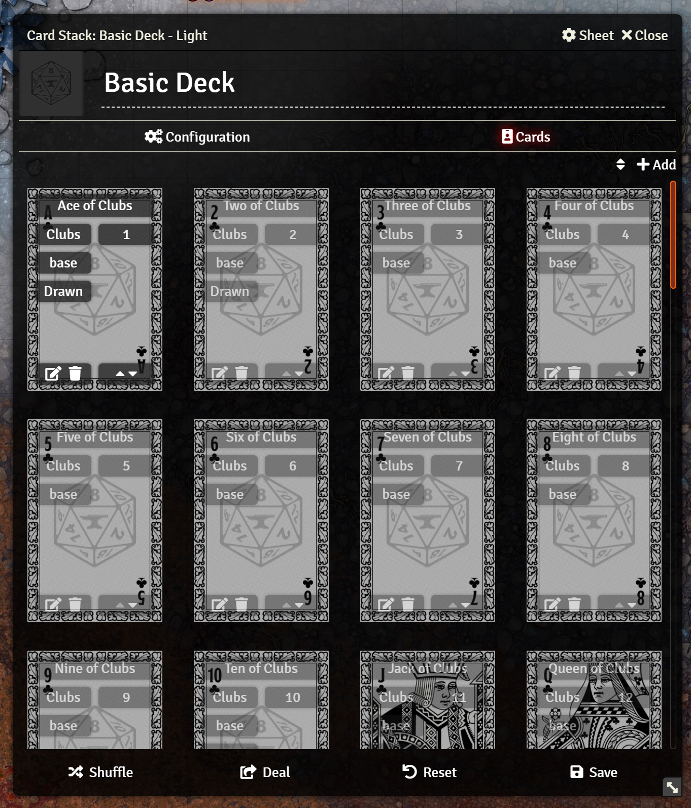
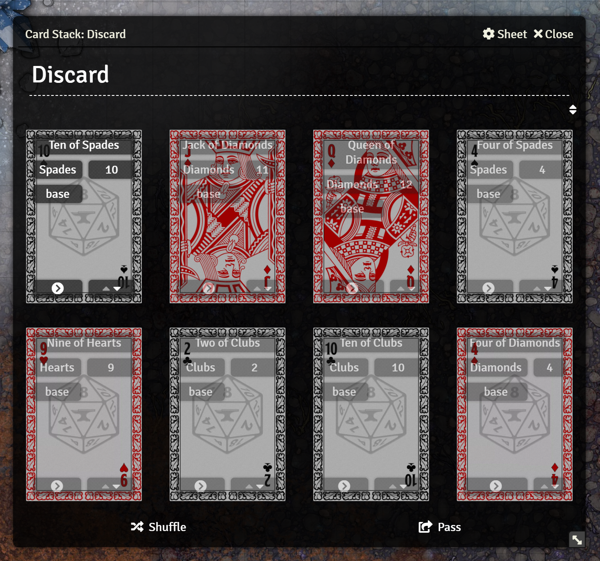
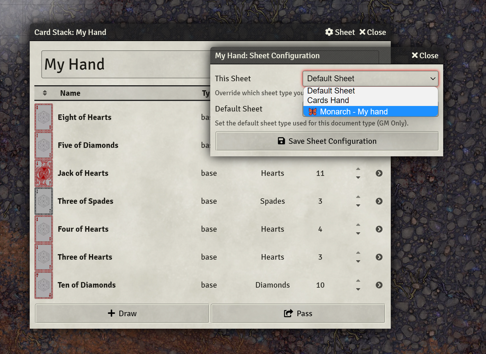
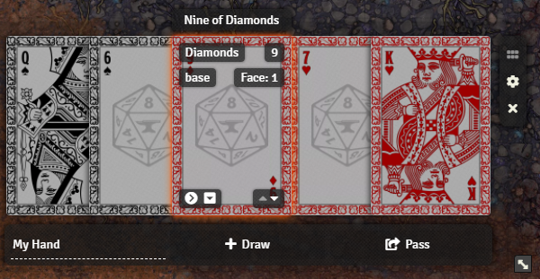
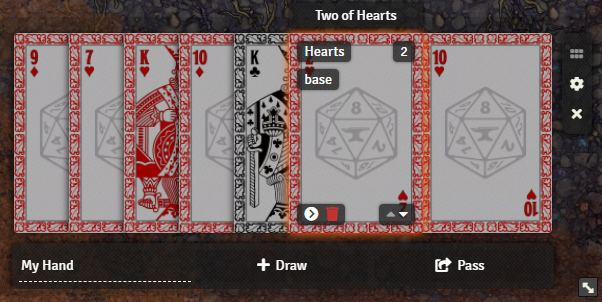
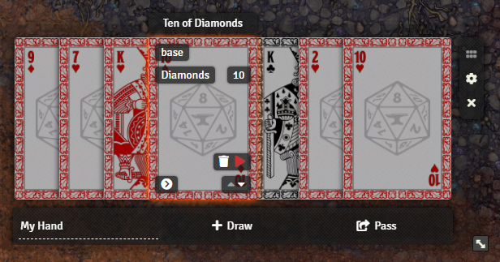
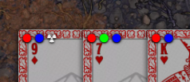
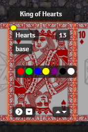
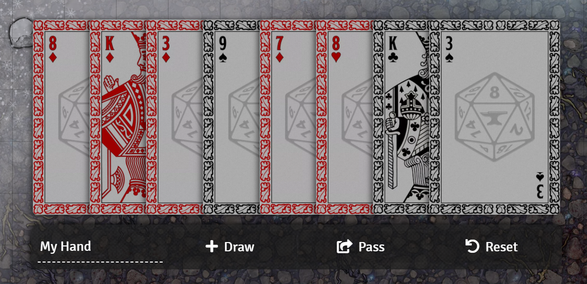

 

# 🦋 Monarch - A card UI fit for royalty.

**Monarch is currently in beta. There are some rough edges and incomplete features. Feel free to open [issues](https://github.com/zeel01/monarch/issues) if you find problems.**

Monarch is an enhanced card UI for Foundry VTT v9+ which provides replacements for card, hand, deck, and pile sheets.


## Features

Monarch includes apps for hands, decks, cards, and piles. It also remembers the positions of open card sheets, and restores them when the application is reloaded. This allows players and GMs to keep their hands, and any important card sheets, open without them being closed acceidentally.

Monarch supports drag and drop, including moving cards between piles, decks, and hands as well as re-ordering cards in these containers.

### Settings

**Card Height** - You can configure the visual hieght of cards in Monarch applications. This value is in pixels, the default is 200. Adjusting this will change how large cards appear in decks, piles, and hands. *Note: Other clients may need to refresh to see this change*

## 🦋 My Hand

The "My Hand" sheet displays your hand similarly to how you might see it in real life. All of the cards are layed out in a compact "fan" format. You can see more details about each card by hovering your mouse over it. You can also play a card, flip it over, or view its individual sheet.


## 🦋 Card

The card sheet is a compact view of a single card which shows off the artwork. When you hover your mouse over the card, you will reveal additional information and can edit its properties. There is a button for editing the faces and back of the card as well. There is also a magnifying glass button to pop open the card artwork for a full view.


## 🦋 Deck

The deck sheet is a slightly restyled version of the standard deck sheet, which shows the card artwork more clearly, and arranges the cards in a grid rather than rows.



## 🦋 Pile 

The pile sheet is very similar to the deck sheet, but with slightly different controls.



## Using Monarch

To use Monarch, open one of the supported documents (card, deck, pile, hand) and click the "⚙️ Sheet" button in the title bar. This will open the sheet config window. You can then choose to set either "This Sheet" for this specific document, or "Default Sheet" for all documents of this type to use the corresponding 🦋 Monarch sheet.



## 🦋 Monarch API

Monarch is designed to be flexible for the various needs of systems and games. It provides an API for adding custom information badges, and custom interactive buttons to the various sheets.

### Technical Details

This section contains technical details about the Monarch API. The next section will give examples and instructions on how to use it.

#### The `Monarch` Class

For convenience, the `Monarch` class has been attached to `window` for global access. This class contains all the base functionality of the module, and references to the various other classes it contains.

#### Hooks

Monarch adds the following hooks:

##### `getMonarch{Application}Components`

This hook fires just before any Monarch sheet renders, the name will depend on which sheet is rendering: `getMonarchHandComponents`, `getMonarchDeckComponents`, `getMonarchPileComponents`, or `getMonarchCardComponents`. This hook is used to gather data for constructing information badges and interactive controls on the application. Hooks for the full inheritance chain of Monarch apllications will fire, including `getMonarchApplicationComponents` as the base and for all `Cards` applications `getMonarchCardsConfigComponents`. This should allow for either per-app control of components, or modification to all apps at once.

###### Parameters
| Parameter | Type | Description |
| --------- | ---- | ----------- |
| `monarch` | `FormApplication` | The Monarch application object. |
| `components` | `Components` | An object containing arrays of different kinds of components. |
| `components.badges` | `Array<CardBadge>` | An array of information badges to add to the application. These are added to each card individually for piles. |
| `components.controls` | `Array<CardControl>` | An array of controls to add to the application. These are added to each card individually for piles. |
| `components.markers` | `Array<CardMarker>` | An array of markers to add to the application. These are added to each card individually for piles. |
| `components.contextMenu` | `Array<CardControl>` | An array of controls to add to context menus. These are added to each card individually for piles. |
| `components.appControls`~~ | `Array<AppControl>` | An array of controls to add to the application. These are added to the application for interacting with the pile itself. This property is ignored for the `Card` sheet, use `controls` |

##### `clickMonarchCard`

This hook is fired whenever a user clicks on a card in one of the `Cards` sheets. Returning false from this hook will prevent the default action from being taken. The default action for cards in the hand sheet is to open the sheet for that card.

###### Parameters
| Parameter | Type | Description |
| --------- | ---- | ----------- |
| `event` | `PointerEvent` | The pointer event that triggered the click. |
| `app` | `FormApplication` | The Monarch application object. |
| `card` | `Card` | The card that was clicked. |

##### `hoverMonarchCard`

This hook is fired whenever a user hovers over a card in one of the `Cards` sheets. Returning false from this hook will prevent the default action from being taken.

###### Parameters
| Parameter | Type | Description |
| --------- | ---- | ----------- |
| `event` | `PointerEvent` | The pointer event that triggered the hover. |
| `app` | `FormApplication` | The Monarch application object. |
| `card` | `Card` | The card that was hovered over. |

#### Data Objects

These objects are used to define certain kinds of dynamic components.

##### `CardBadge`

Data to define an information badge that will display on a card.

###### Properties
| Property | Type | Description |
| -------- | ---- | ----------- |
| `tooltip` | `string`<br>`Function<string>` | Used as the HTML `title` attribute providing a tooltip describing/labeling this badge. May be a function that returns a string. |
| `text` | `string`<br>`Function<string>` | The text to display on the badge, may contain HTML. May be a function that returns a string. |
| `class` | `string` | *Optional*. A CSS class to apply to the badge. |
| `hide` | `boolean`<br>`Function<boolean>` | *Optional*. Whether or not to hide the badge, not including it in the HTML. May be a function that returns a boolean, useful for badges that only display under certain conditions. `false` by default. |

##### `CardMarker`

Data to define an icon marker that will display on a card.

###### Properties
| Property | Type | Description |
| -------- | ---- | ----------- |
| `tooltip` | `string`<br>`Function<string>` | Used as the HTML `title` attribute providing a tooltip describing/labeling this marker. May be a function that returns a string. |
| `class` | `string` | *Optional*. A CSS class to apply to the marker. |
| `icon` | `string`<br>`Function<string>` | The font awesome icon class to display on the marker, defailt is `"fa fas-circle"` (a dot). May be a function that returns a string. |
| `color` | `string`<br>`Function<string>` | The color of the marker, default is `"#FFFFFF"` (white). May be a function that returns a string. |
| `show` | `boolean`<br>`Function<boolean>` | Whether or not to show the marker. May be a function that returns a boolean, useful for markers that only display under certain conditions. `false` by default. |
##### `CardControl`

Data to define an interactive contrl that will display on a card.

###### Properties
| Property | Type | Description |
| -------- | ---- | ----------- |
| `label` | `string`<br>`Function<string>` | A text label for the control, only displayed for context menu controls. May be a function that returns a string. |
| `tooltip` | `string`<br>`Function<string>` | Used as the HTML `title` attribute providing a tooltip describing/labeling this control. May be a function that returns a string. |
| `aria` | `string`<br>`Function<string>` | The ARIA label for the control, used by screen readers to identify it. When omitted, the `tooltip` will be used instead. May be a function that returns a string. |
| `icon` | `string`<br>`Function<string>` | The classes used to display a font awesome icon (ex: `"fas fa-caret-up"`). May be a function that returns a string. |
| `color` | `string`<br>`Function<string>` | The color of the icon, default is `"#FFFFFF"` (white). May be a function that returns a string. |
| `class` | `string` | A unique CSS class to apply to the control. **IMPORTANT**: This property is required. Monarch uses this class to identify the control in order to attach event listeners. |
| `disabled` | `boolean`<br>`Function<boolean>` | *Optional*. Whether or not to disable the control. The control will appear grayed out. May be a function that returns a boolean. `false` by default. |
| `onclick` | `Function<void>` | A function that will run when the control is clicked. See below for parameter information. |
| `controls` | `Array<CardControl>` | *Optional*. An array of controls to be added as a control group. When included, you may omit all other properties except `class`. Instead, each item in this `controls` array should be a complete `CardControl` object. Does not support nesting. |

###### `onclick` Parameters
| Parameter | Type | Description |
| --------- | ---- | ----------- |
| `event` | `PointerEvent` | The mouse event that triggered the click. |
| `card` | `Card` | The card that the control is on. |
| `container` | `Cards` | The Cards object that the card is a member of. |

##### `AppControl`

Data to define an interactive contrl that will display on the application. Not used for the `Card` appliction, just use `CardControl` instead.

###### Properties
| Property | Type | Description |
| -------- | ---- | ----------- |
| `label` | `string`<br>`Function<string>` | A text label for the control. May be a function that returns a string. |
| `tooltip` | `string`<br>`Function<string>` | Used as the HTML `title` attribute providing a tooltip describing/labeling this control. May be a function that returns a string. |
| `aria` | `string`<br>`Function<string>` | The ARIA label for the control, used by screen readers to identify it. When omitted, the `tooltip` will be used instead. May be a function that returns a string. |
| `icon` | `string`<br>`Function<string>` | The classes used to display a font awesome icon (ex: `"fas fa-caret-up"`). May be a function that returns a string. |
| `class` | `string` | A unique CSS class to apply to the control. **IMPORTANT**: This property is required. Monarch uses this class to identify the control in order to attach event listeners. |
| `disabled` | `boolean`<br>`Function<boolean>` | *Optional*. Whether or not to disable the control. The control will appear grayed out. May be a function that returns a boolean. `false` by default. |
| `hide` | `boolean`<br>`Function<boolean>` | *Optional*. Whether or not to hide the control entirely. |
| `onclick` | `Function<void>` | A function that will run when the control is clicked. See below for parameter information. |

###### `onclick` Parameters
| Parameter | Type | Description |
| --------- | ---- | ----------- |
| `event` | `PointerEvent` | The mouse event that triggered the click. |
| `app` | `FormApplication` | The application that the control is on. |
| `container` | `Cards` | The Cards object that the application represents. |

### Value or Function Callbacks

Many of the values specified for Components can be either a string or boolean *or* a function that returns a value. This allows for per-card values by calling the given function for each card in a pile, or for values that apply to all cards by passing a static value. These functions will be passed the following parameters:

##### Parameters

###### For `CardControl`s
| Parameter | Type | Description |
| --------- | ---- | ----------- |
| `card` | `Card` | The card that the component is for. |
| `container` | `Cards` | The Cards object that the card is a member of. |

###### For `AppControl`s
| Parameter | Type | Description |
| --------- | ---- | ----------- |
| `app` | `FormApplication` | The application that the component is on. |
| `container` | `Cards` | The Cards object that the application represents. |

### API Guide

This section contains a series of brief examples explaining how to use certain sections of the Monarch API.
#### Creating a Custom Badge

As an example we will create an info badge on the hand sheet indicating the number of the currently displayed face.

```js
Hooks.on("getMonarchHandComponents", (monarch, components) => {
    components.badges.push({
        tooltip: "Current Face",
        text: (card) => `Face: ${card.data.face}`,
        class: "card-face-num"
    });
});
```
We use the `getMonarchHandComponents` hook to respond when the hand is being displayed. This hook provieds two parameters, the first is the application instance itself, the second is an object containing arrays. Each array contains objects of data pertaining to some kind of component. One of these is `badges`.

This data is an array of objects, each of which describes a badge. Check the technical details above for more information on the badge object.

In this case, we just use `Array.push` to add a new badge to the `components.badges` array. This will add a new badge after all the existing ones.

Aside from the `class` property, the other properties of a badge shown above may be either a string or a function. A string is used in this tooltip, because we don't need it to be different for each card in the hand. However, the `text` needs to be different for each card, so we give it a function instead that will return a string later. When this function is called, it will be passed parameters. The first parameter is the `Card` object for the card this text will be displayed on. This function will be called for *each* card in the hand.

Here, we simply have the function return a string created from a template literal. It will always look like "Face: #" where # is the current face shown of the card.



#### Creating a Custom Control

Custom controls are created very similarly to badges, but they have a bit more data assocaiated with them. In this example, we will re-implement the "discard" button available in Monarch.

```js
Hooks.on("getMonarchHandComponents", (monarch, components) => {
    components.controls.push({
        tooltip: "monarch.label.discard",
        icon: "fas fa-trash",
        class: "discard-card",
        onclick: (event, card) => card.pass(game.cards.getName("Discard"))
    });
});
```
Of note, the `tooltip` here is being given a localization key rather than a plain string. Monarch will always attempt to localize the provided tooltip allowing you to use localization easily.

Controls also have an `icon` property. Like tooltip this can optionally be a function that returns a string. This string should identify a font-awesome icon to use for this control.

The most important thing that sets a control apart from a badge, is the `onclick` property. This must be a function, and it will be called when the button is clicked on the sheet. It will recieve a number of parameters (see technical details above) including the click event and the card that the control was used on.

IMPORTANT: Along with `onclick` you *must* include a unique `class` property for each control. This class is what's used by Monarch to attach the correct event listener to the contol element.

Here, we look up a pile in `game.cards` called "Discard" and pass the card to it. This is an example, in everyday use we would want to do something to prevent errors in case no such pile exists.


#### Custom Control Groups

Above, you may notice that the "discard" button is in a seperate box from the play button. But the standard Monarch discard button when enabled appears in the same box next to the play button. This is because you can also create *groups* of controls. Each control object may contain an array `controls` of control objects to display together in a group.

The control group created by Monarch is called `basic-controls`, if we search through the controls array for this item we can add our control to the same group:

```js
Hooks.on("getMonarchHandComponents", (monarch, components) => {
    components.controls.find(c => c.class === "basic-controls").controls.push({
        tooltip: "monarch.label.discard",
        icon: "fas fa-trash",
        class: "discard-card",
        onclick: (event, card) => card.pass(game.cards.getName("Discard"))
    });
});
```
Here we used `Array.find` to locate a control that has the class `basic-controls`. We then pushed our control onto its `controls` array.



If we wanted to create our own control group, we could do so like this:
```js
Hooks.on("getMonarchHandComponents", (monarch, components) => {
    components.controls.push({
        class: "my-controls",
        controls: [
            {
                tooltip: "monarch.label.discard",
                icon: "fas fa-trash",
                class: "discard-card",
                onclick: (event, card) => card.pass(game.cards.getName("Discard"))
            },
            {
                tooltip: "CARD.Play",
                icon: "fas fa-play",
                class: "play-card",
                onclick: (event, card, pile) => pile.playDialog(card)
            }
        ]
    });
});
```
Here we push a new object into `components.controls`, and that object contains a `class` and its own `controls` array. That array contains two new controls we want to make.



#### Creating a Custom Marker

Markers are similar to badges, but they don't contain text. They are also always visible on the hand, rather than just when the card is hovered. Markers are colored icons that can be used to indicate any number of things.

In this example, we will create a custom "radioactive" marker that can be shown on cards.
```js
Hooks.on("getMonarchHandComponents", (monarch, components) => {
    components.markers.push({
        tooltip: `Radioactive`,
        class: `marker-radioactive`,
        icon: "fas fa-radiation",
        color: "#EEEEEE",
        show: (card) => card.data.flags.monarch.markers.radioactive
    })
});
```
By default a marker will show a white dot, using the `fa fas-circle` icon. By specifying icon and color we can choose any font awesome icon and any color. The color should be a valid CSS color value.

The last property of `CardMarker` is `show`. Here, we define `show` as a function that takes a card as a parameter and checks for a flag within it. If that flag is true, the icon will be shown as a marker on the card. This function is called for each card in the hand, so each card can have this marker configured individually.



#### Creating Custom Context Menus

Very similar to creating controls, context menus are created by adding control objects to the `controls.contextMenu` array. These controls won't show on the card when hovered, but will appear when right-clicked. These controls also support a `label` property that can be used to display a label for the menu item. If a `control` has an array of `controls`, a no-label row of icon buttons will be created instead.



#### Creating Custom Application Controls

Unlike card controls, markers, and badges these controls apply to the `Cards` object/application rather than to a specific card. These are used for buttons like "draw" in a hand or "shuffle" in a deck. For these, you add `AppControl` objects to the `controls.appControls` array.

As an example, we will add a "reset" button to the hand application.

```js
Hooks.on("getMonarchHandComponents", (monarch, components) => {
    components.appControls.push({
        label: "CARDS.Reset",
        icon: "fas fa-undo",
        class: "reset-pile",
        onclick: (event, app, pile) => pile.resetDialog()
    });
});
```

Note that the parameters for the `onclick` callback are different than for a `CardControl`, since there isn't a target `Card` object for this control.

